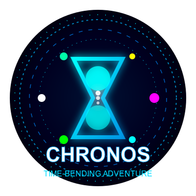
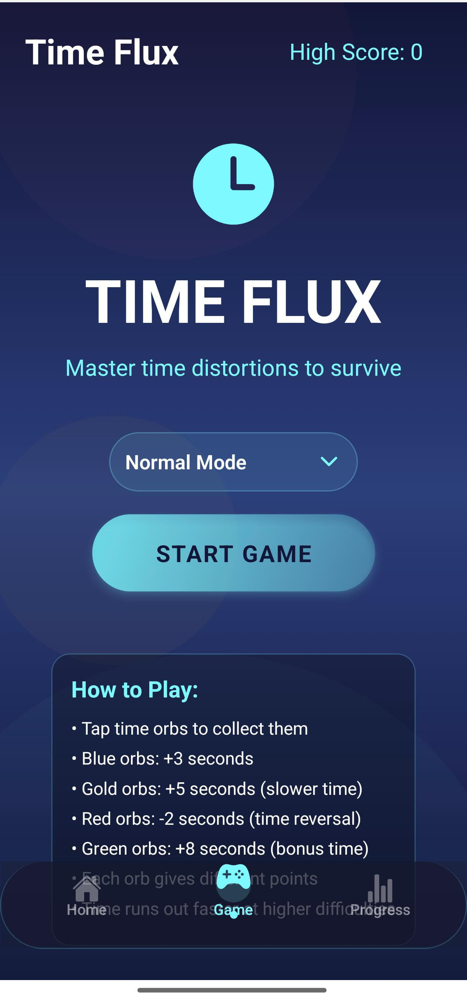
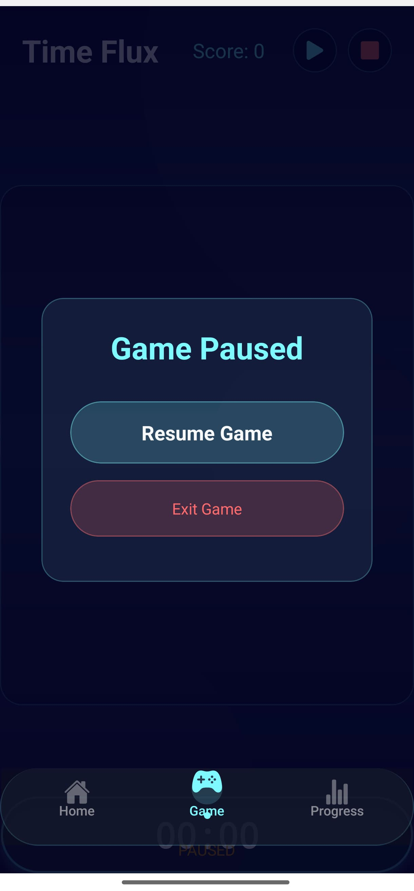
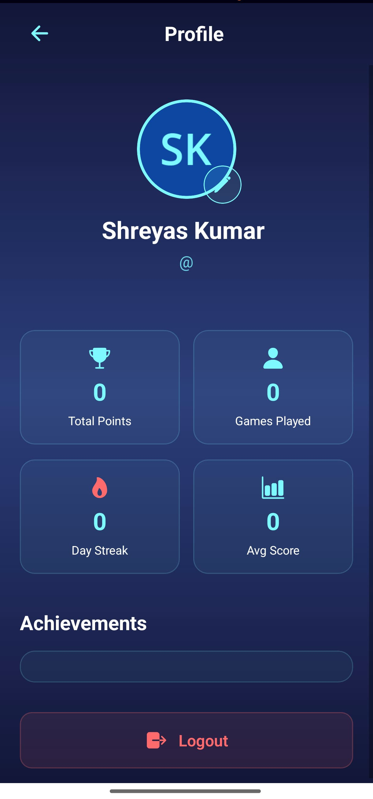
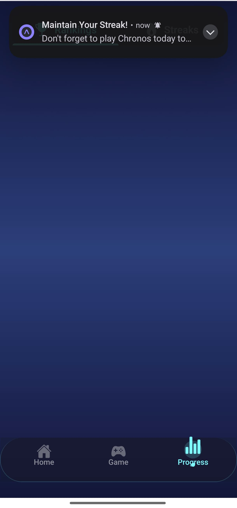
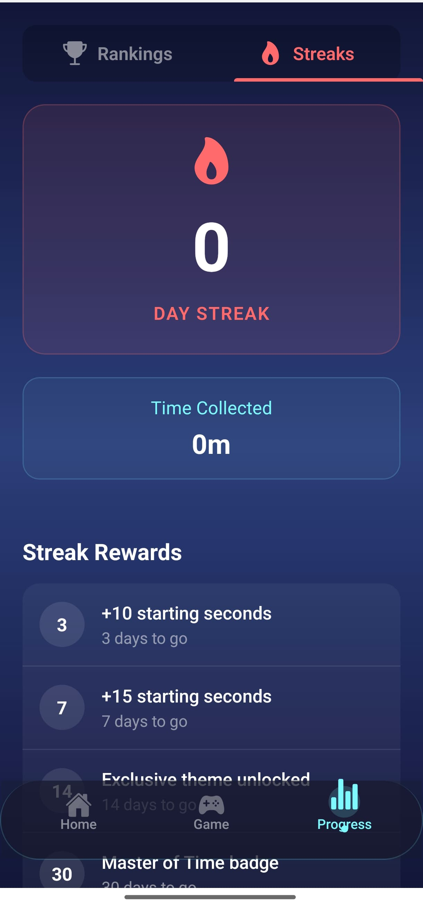

# <div align="center">⏱️ CHRONOS: Time-Bending Adventure ⏱️</div>

<div align="center">
  <a href="#"></a>
  <a href="#"></a>
  <a href="#"></a>
  <a href="#"></a>
</div>

<p align="center">
  
</p>

<div align="center">
  <h3>🌟 <i>Where Time Bends to Your Will</i> 🌟</h3>
  <p></p>
</div>

<!-- GitHub-compatible styling alternatives -->
<!-- Using emojis and markdown for visual appeal instead of CSS animations -->

## 🚀 About The Game

**CHRONOS** is a futuristic, time-bending action game where players control a time orb to collect various time objects. Each object has unique properties that affect gameplay:

- ⏱️ **Time Objects** (+10 points) - Collect these standard objects to increase your score
- ⌛ **Hourglass** (+5 seconds) - Adds precious seconds to your timer
- ↩️ **Reverser** (-5 points) - Avoid these objects that decrease your score
- ⭐ **Bonus** (+25 points) - Rare objects that give substantial point boosts

<div align="center">
  
</div>

<!-- GitHub-compatible styling alternatives -->
<!-- Using emojis and special characters for visual appeal instead of CSS animations -->

## 🎮 Game Features

<div align="center">

| 🔄 Combo System | 📈 Level Progression | ✨ Particle Effects |
|:---------------:|:--------------------:|:-------------------:|
| Chain object collections for multipliers up to 3x | Game difficulty increases as your score grows | Stunning visual feedback for each interaction |
|  |  |  |

| 📳 Haptic Feedback | 🏆 High Score Tracking | 🎓 Tutorial System |
|:------------------:|:----------------------:|:------------------:|
| Feel each collection with device vibrations | Compete against yourself and break records | Learn the mechanics before jumping into action |
|  |  |  |

</div>

<div align="center">

```
┌─────────────────────────────────────────────────────────────────────────┐
│                                                                         │
│                      ⭐ EXCLUSIVE GAME FEATURES ⭐                      │
│                                                                         │
└─────────────────────────────────────────────────────────────────────────┘
```

</div>

<details>
<summary><b>🔮 Upcoming Features</b></summary>

- **Time Freeze**: Temporarily pause all objects except your orb
- **Multiplayer Mode**: Compete against friends in real-time
- **Custom Themes**: Personalize your game environment
- **Achievement System**: Unlock special rewards and badges
- **Weekly Challenges**: New objectives refreshed every week

</details>

## 🖥️ App Showcase

<div align="center">
  <table style="border-collapse: separate; border-spacing: 10px; background: linear-gradient(to right, #000428, #004e92); border-radius: 15px; padding: 15px; box-shadow: 0 10px 20px rgba(0,0,0,0.3);">
    <tr>
      <td align="center" style="padding: 10px; background: rgba(255,255,255,0.1); border-radius: 10px;"><strong style="color: #61DAFB;">Splash Screen</strong></td>
      <td align="center" style="padding: 10px; background: rgba(255,255,255,0.1); border-radius: 10px;"><strong style="color: #61DAFB;">Home Screen</strong></td>
      <td align="center" style="padding: 10px; background: rgba(255,255,255,0.1); border-radius: 10px;"><strong style="color: #61DAFB;">Game Interface</strong></td>
    </tr>
    <tr>
      <td></td>
      <td></td>
      <td></td>
    </tr>
    <tr>
      <td align="center" style="padding: 10px; background: rgba(255,255,255,0.1); border-radius: 10px;"><strong style="color: #61DAFB;">Game Action</strong></td>
      <td align="center" style="padding: 10px; background: rgba(255,255,255,0.1); border-radius: 10px;"><strong style="color: #61DAFB;">Profile</strong></td>
      <td align="center" style="padding: 10px; background: rgba(255,255,255,0.1); border-radius: 10px;"><strong style="color: #61DAFB;">Progress Tracking</strong></td>
    </tr>
    <tr>
      <td></td>
      <td></td>
      <td></td>
    </tr>
    <tr>
      <td colspan="3" align="center" style="padding: 10px; background: rgba(255,255,255,0.1); border-radius: 10px;"><strong style="color: #61DAFB;">Streaks & Achievements</strong></td>
    </tr>
    <tr>
      <td colspan="3" align="center"></td>
    </tr>
  </table>
</div>

## 🛠️ Technology Stack

<div align="center">
  <div style="background: linear-gradient(to right, #000428, #004e92); border-radius: 15px; padding: 20px; margin: 20px 0; box-shadow: 0 10px 20px rgba(0,0,0,0.3);">
    <div style="display: flex; justify-content: space-around; flex-wrap: wrap; margin-bottom: 15px;">
      
      
      
    </div>
    <div style="display: flex; justify-content: space-around; flex-wrap: wrap;">
      
      
      
    </div>
  </div>
</div>

## 💻 Installation

```bash
# Clone the repository
git clone https://github.com/shkshreyas/Chronos-Android.git

# Navigate to project directory
cd Chronos-Android

# Install dependencies
npm install

# Start the development server
npm run dev
```

## 🧰 Useful Scripts

The game comes with several helpful scripts to make development easier:

```bash
# Start the development server
npm run dev

# Start with a clean cache (fixes many common issues)
npm run clean-start

# Update dependencies to latest compatible versions
npm run update-deps

# Run Expo linting
npm run lint

# Build for web
npm run build:web
```

## 🎯 How To Play

<div align="center">

| Step | Action | Description |
|:----:|:------:|:------------|
|  |  | Create your profile or login to your existing account |
|  |  | Learn the game mechanics through the interactive tutorial |
|  |  | Drag your finger across the screen to move your time orb |
|  |  | Gather time objects to increase your score and build combos |
|  |  | Dodge reverse objects that decrease your score |
|  |  | Aim for the highest score before time runs out! |

</div>

<div align="center">

```
┌─────────────────────────────────────────────────────────────────────────┐
│                                                                         │
│                      🎮 MASTER THE TIME CONTROLS 🎮                     │
│                                                                         │
└─────────────────────────────────────────────────────────────────────────┘
```

</div>

<details>
<summary><b>🔍 Pro Tips & Tricks</b></summary>

- **Combo Strategy**: Focus on collecting objects in rapid succession
- **Time Management**: Prioritize hourglasses when timer gets low
- **Score Multipliers**: Build and maintain your combo streak for maximum points
- **Object Patterns**: Learn to recognize spawn patterns for better anticipation
- **Practice Mode**: Use the tutorial mode to perfect your reflexes

</details>

## 🔄 Game Controls

<div align="center">

|  |  |  |
|:---:|:---:|:---:|
| Move your time orb across the screen | Restart after game over | Collect objects quickly to increase your multiplier |

</div>

<details>
<summary><b>🎮 Advanced Control Tips</b></summary>

- **Quick Flick**: Rapidly move across the screen with a quick flick gesture
- **Edge Hover**: Position near screen edges to attract nearby objects
- **Combo Timing**: Collect objects within 1.5 seconds of each other to maintain combos
- **Reverser Dodge**: Quick zigzag movements help avoid reverser objects

</details>

## ⏳ Gameplay Timeline

<div align="center">

```
┌─────────────────────────────────────────────────────────────────────────┐
│                                                                         │
│                         CHRONOS GAMEPLAY FLOW                          │
│                                                                         │
└─────────────────────────────────────────────────────────────────────────┘
                                  │
                                  ▼
┌─────────────────────────────────────────────────────────────────────────┐
│                                                                         │
│  🕒 START GAME                                                          │
│  ───────────                                                           │
│  Begin with 30 seconds on the clock                                    │
│                                                                         │
└─────────────────────────────────────────────────────────────────────────┘
                                  │
                                  ▼
┌─────────────────────────────────────────────────────────────────────────┐
│                                                                         │
│  🔮 COLLECT OBJECTS                                                    │
│  ────────────────                                                      │
│  Gather time objects to increase score                                 │
│                                                                         │
└─────────────────────────────────────────────────────────────────────────┘
                                  │
                                  ▼
┌─────────────────────────────────────────────────────────────────────────┐
│                                                                         │
│  ⚡ BUILD COMBOS                                                       │
│  ────────────                                                          │
│  Chain collections for multipliers                                     │
│                                                                         │
└─────────────────────────────────────────────────────────────────────────┘
                                  │
                                  ▼
┌─────────────────────────────────────────────────────────────────────────┐
│                                                                         │
│  🏁 GAME OVER                                                          │
│  ──────────                                                            │
│  When time runs out, your score is recorded                            │
│                                                                         │
└─────────────────────────────────────────────────────────────────────────┘
```

</div>

<div align="center">

### Alternative Timeline View

| Stage | Description |
|:-----:|:------------|
|  | Begin with 30 seconds on the clock |
| ⬇️ | |
|  | Gather time objects to increase score |
| ⬇️ | |
|  | Chain collections for multipliers |
| ⬇️ | |
|  | When time runs out, your score is recorded |

</div>
  </div>
</div>

## 🛠️ Troubleshooting

If you encounter any issues while running the game:

1. **Metro Bundler issues**: Run `npm run clean-start` to clear caches and restart
2. **Dependency errors**: Run `npm run update-deps` to update to compatible versions
3. **Device connection problems**: Make sure your device and computer are on the same network

## 👨‍💻 Contributing

Contributions are welcome! Please feel free to submit a Pull Request to our [GitHub repository](https://github.com/shkshreyas/Chronos-Android).

## 📄 License

This project is licensed under the MIT License - see the LICENSE file for details.

## 📬 Contact

For inquiries, please reach out to us at [shkshreyaskumar@gmail.com](mailto:shkshreyaskumar@gmail.com)

<div align="center">


```
  _____  _   _  _____   ____  _   _  ____   _____ 
 |_   _|| | | ||  ___| / ___|| | | ||  _ \ / ____|
   | |  | |_| || |__  | |    | |_| || |_) | (___  
   | |  |  _  ||  __| | |    |  _  ||  _ < \___ \ 
   | |  | | | || |___ | |___ | | | || |_) |____) |
   |_|  |_| |_||_____| \____||_| |_||____/|_____/ 
                                                   
```

> *"In the game of time, every second counts."*

<table>
  <tr>
    <td align="center"></td>
    <td align="center"></td>
    <td align="center"></td>
  </tr>
</table>

<details>
<summary><b>🌟 Special Thanks</b></summary>

- **Time Keepers**: Our dedicated beta testers
- **Chronos Team**: Developers, designers, and visionaries
- **You**: For exploring our time-bending adventure

</details>

</div>
